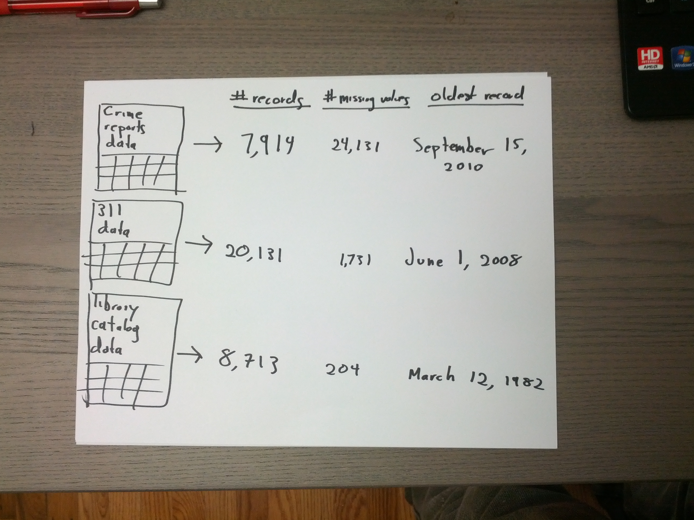
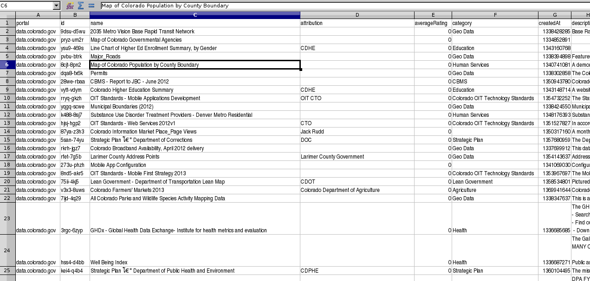

<!-- For the winter issue of Socrata's magazine -->

The opening of data has advanced and is now a well-documented process. There is data on how people publish and consume open data, which means you can set up data-backed benchmarks and projections and make data-driven decisions about your strategy for opening data.

How is this possible? Datasets are complicated, but we can extract simple properties from the datasets, like the number of missing values and the number of columns.

In addition to the dataset itself, we also have metadata published alongside the dataset; metadata tells us things like who published the data and how many times it has been downloaded. Below are some metadata (from [here](https://data.mo.gov/views/mahp-izvx.json)) about Missouri's [open meetings calendar](https://data.mo.gov/Government-Administration/Open-Meetings-Calendar/mahp-izvx).

    "id" : "mahp-izvx",
    "name" : "Open Meetings Calendar",
    "averageRating" : 0,
    "category" : "Government Administration",
    "createdAt" : 1337110426,
    "description" : "Schedule of Missouri Open Meetings",
    "displayType" : "calendar",
    "downloadCount" : 68,
    "iconUrl" : "10D0D792-72EC-474C-8605-2958B80EE8A2",
    "moderationStatus" : true,
    "newBackend" : false,
    "numberOfComments" : 0,
    "oid" : 6433334,
    "publicationAppendEnabled" : false,
    "publicationDate" : 1384531257,
    "publicationGroup" : 326921,
    "publicationStage" : "published",
    "rowsUpdatedAt" : 1384531248,
    "rowsUpdatedBy" : "8xqn-4t42",

By extracting some properties from each dataset and collecting metadata about each dataset, it’s possible to create a dataset about the publication and use of other datasets.

## Datasets as Data Points
In a dataset of other datasets (e.g. a super-dataset), you create a single row or record (a data point) about each dataset, containing information like when that dataset was published, what kind of data it contains, etc. With this setup, you can naturally perform all kinds of functions and analysis about the publication and use of other datasets: you can look at [how many datasets are on different catalogs](http://thomaslevine.com/!/socrata-deduplicate/),

how data are [queried and reported](http://www.chriswhong.com/nycopendata/),

what [licenses](http://thomaslevine.com/!/open-data-licensing) datasets have,

and how many of them are [traffic surveys](http://thomaslevine.com/!/missouri-data-licensing/).

We often talk about studying open data and building products from open data, but the examples above are something different.
In these cases, we're collecting a super-dataset about open data in order to study how people publish and use open data.

## Metadata as Data
Even though the word "metadata" contains the word "data", people don’t typically think of metadata as actual data. In the context of open data, we use metadata to search for data, label charts, and interpret specific datasets; we don’t think of metadata as data that we can analyze. 

However, if you import metadata about a dataset into a super-dataset, that metadata suddenly becomes real data, offering meaningful information such as time of publication, description of content, and download count.

## Why This Matters
Ironically, open data initiatives so far haven't been particularly data-driven. There are numerous case studies
([Code for America](http://beyondtransparency.org/),
[Socrata](http://www.socrata.com/case-studies/),
[CKAN](http://ckan.org/case-studies/),
[Open Data Institute](http://theodi.org/case-studies))
about how to open up government data, but these are based strongly on personal experiences about opening data and not on precise, quantitative data about opening data.

There is [comparatively little](http://thomaslevine.com/open-data) work that uses data to come up with guidelines or decisions about the opening of data. Similarly, no data catalog software implements standard data-driven features like randomized experiments (A/B testing) and recommender systems.

By opening data, people are also producing data about their release of data, which could be used to make open data initiatives more data-driven. That is, it’s possible to measure how people use the data being opened up, who tends to use which datasets, and which formats are best for different people. It’s also possible to help people find datasets they wouldn't have thought to search for and automate processes for dataset quality-control.

Open data efforts aren't very data-driven right now, but it shouldn't be hard to change that. Most data catalogs are already collecting some sort of data about how people use their datasets, and it’s possible to study existing data to drive decisions about open data. This is almost achievable and mostly just requires a shift in thinking.

## Open Data Should Be Data-Driven
Open data portals make it easier to organize data for publication, but they don't yet provide the bigger picture of what's going on, what's working, and what isn't. We haven't made it easy to see what sorts of data are available, who's using them, what impact they're having, or whether they are of good quality.

Collecting data about the use of open data forms a clearer picture of what is happening in open data. Making data-driven decisions about open data becomes achievable. All it takes is for people to start thinking of metadata as data and see datasets as data points.
