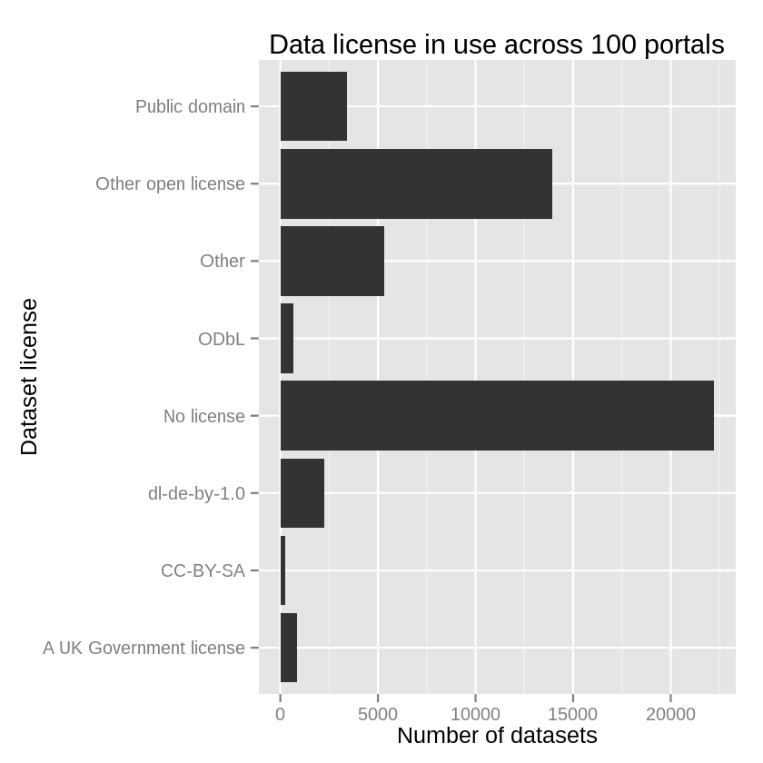

Open data are "open", but do their licenses reflect that?
I downloaded all of the metadata files from 102 open data
portals hosted on CKAN, Socrata and OpenDataSoft. Each of
these data portal softwares has a metadata field for the
license of each particular dataset. I looked at whether
those were used and at what the licenses were.

I looked first at whether people used the metadata field at
all.

Surprisingly to me, all datasets in most portals have a
license field set.

I then made a rough mapping between the free-form names of the
licenses and some standard licenses. I didn't test this
very well, so there are probably some errors, but I think
these results are informative regardless. Here are the
standardized licenses for all of the data.

While many datasets have standard open licenses, the licenses
for most datasets are marked as something like "not specified"
in this field. (They are probably specified elsewhere.)
I looked at the variation within a few portals.

As you see, it seems like each portal chooses one or two of the
standard licenses for the bulk of its datasets. But a substantial
portion of datasets have no license field or have no specified
license. What's going on here? Let's hope that an open license is
specified elsewhere.

like [CC0](http://creativecommons.org/publicdomain/zero/1.0/)
http://opendatacommons.org/licenses/odbl/summary/
