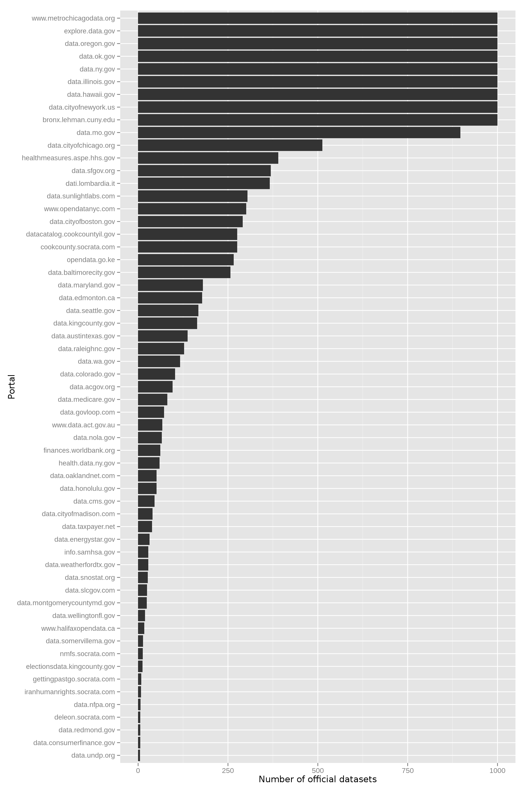
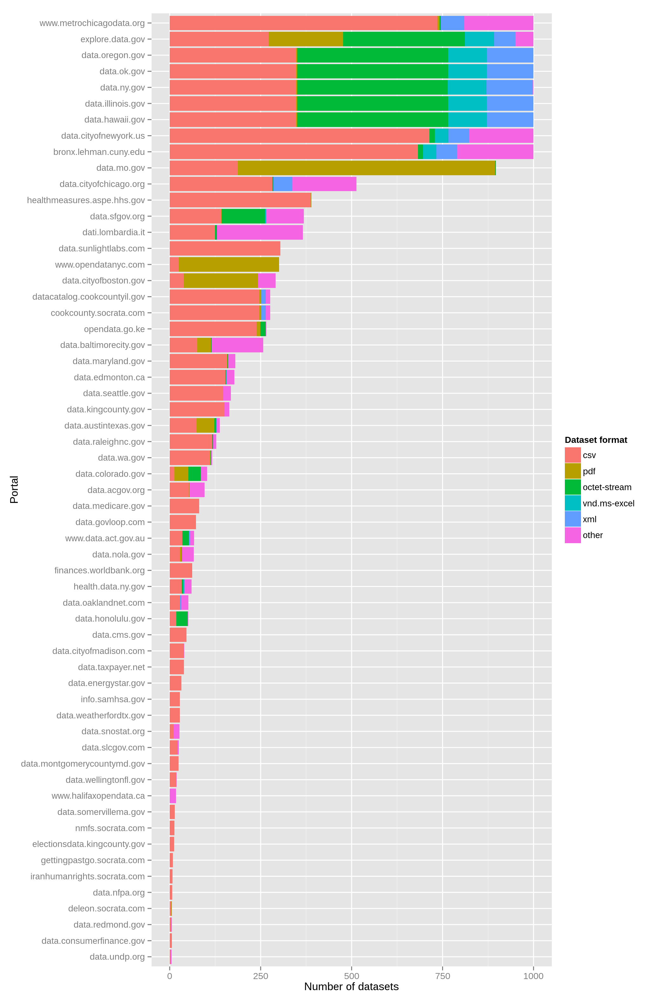
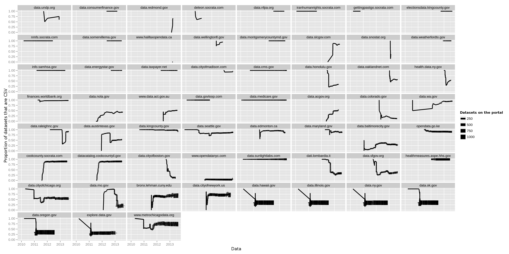
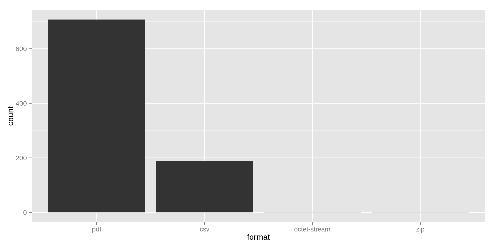
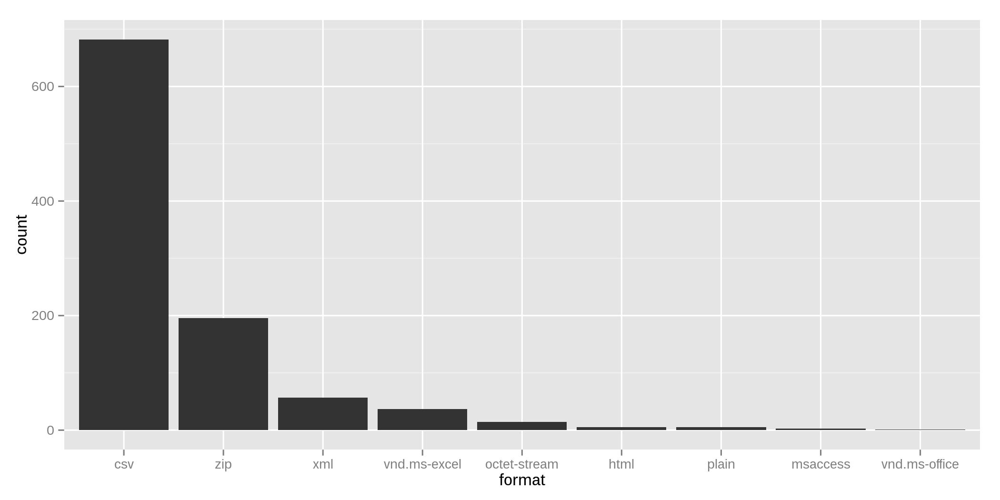
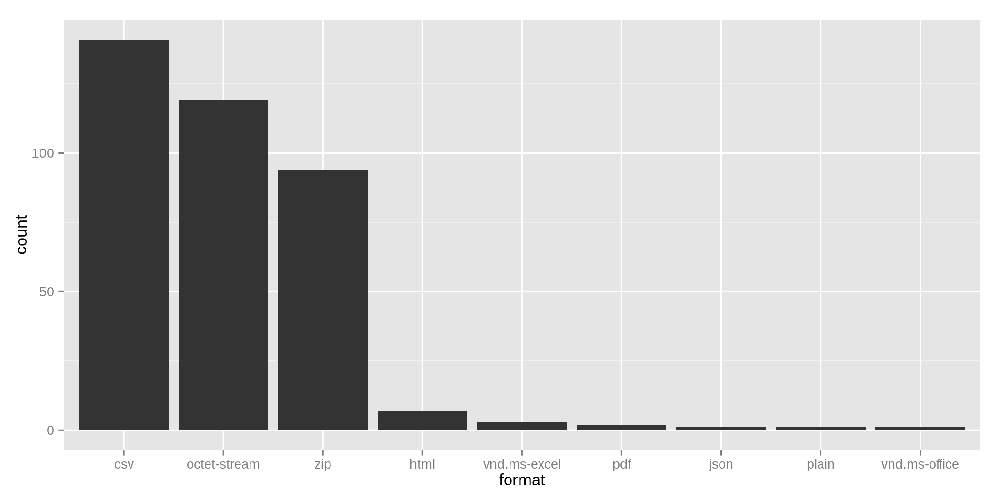
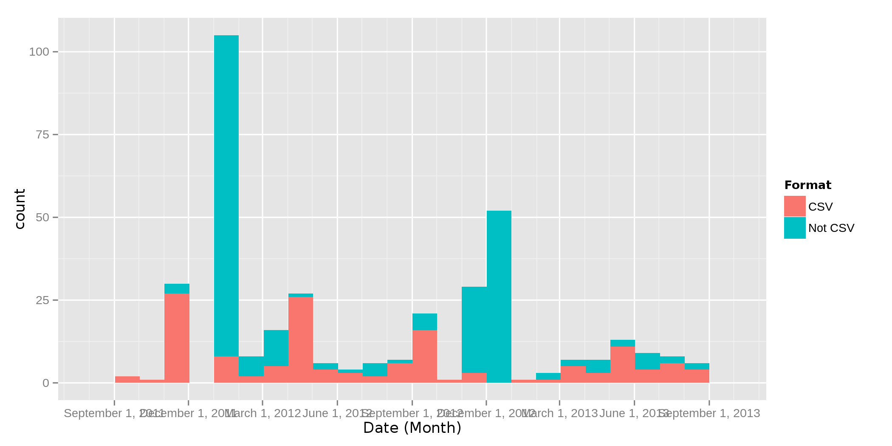
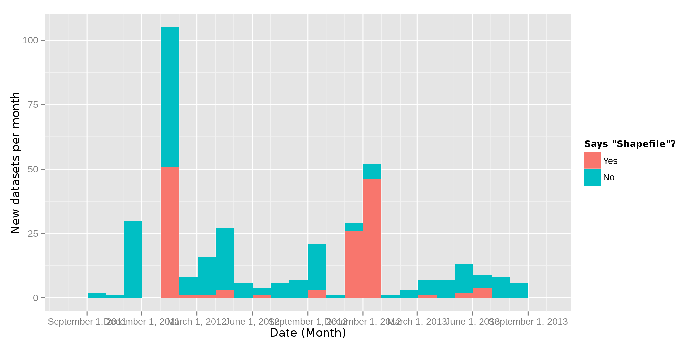
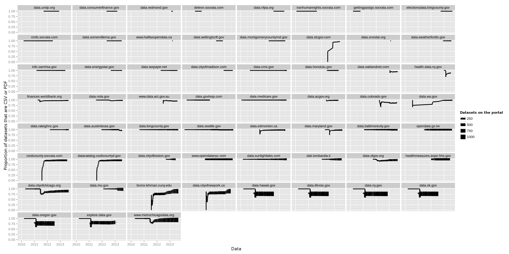

I found some more open data about open data to [study](/socrata)!
While [at Socrata's office](http://www.socrata.com/blog/my-visit-to-socrata-and-data-analysis-about-data-analysis/) on Friday,
I learned of the [`/data.json`](https://data.oregon.gov/data.json) endpoint.
It contains an entry for each [dataset](/!/socrata-genealogies/#term-dataset),
uploaded by the data publisher; it doesn't contain all of the other
views that are based on these source datasets.
And it has [this format](http://project-open-data.github.io/schema/).

## How many datasets?
Socrata portals have [50,000 different views](/!/socrata-users/#the-user-data-format), but only
8922 are original datasets.

The `/data.json` files include federated datasets, so some of these
datasets are duplicated. I did not remove duplicates, so I'm working
with 15699 datasets, with a median of
96 datasets per portal.

{:.wide}

### No derived datasets
This is much lower than my [earlier figure](/!/socrata-summary)
because the present figure does not include [derived views](/!/socrata-genealogies#soda-queries-filtered-views-charts-maps) (map, charts, &c.).

Some time, I'll compare the within-portal counts of original datasets
and derived datasets. But not right now.

### Federated data
It still includes [federated data](/!/socrata-genealogies/#term-federation) (duplicates),
however, and this file doesn't make it easy to determine which direction
the federation is in. The following plot gives us an idea of how many of
these datasets are duplicates.

{:.wide}

Most of the datasets are not duplicates, but some are duplicated many times.

Some day, I'll look more at federation, probably by 
reading the federation information from home pages of the portals
or by following the links in the `/data.json` file.

### Cutoff at 1000?
I find it highly suspicious the following nine portals have exactly 1000
datasets and no portals have more than 1000 datasets.

    paste(names(sort(table(datasets$portal), decreasing = T)[1:9]), collapse = "\n")

* [bronx.lehman.cuny.edu](https://bronx.lehman.cuny.edu)
* [data.cityofnewyork.us](https://data.cityofnewyork.us)
* [data.hawaii.gov](https://data.hawaii.gov)
* [data.illinois.gov](https://data.illinois.gov)
* [data.ny.gov](https://data.ny.gov)
* [data.ok.gov](https://data.ok.gov)
* [data.oregon.gov](https://data.oregon.gov)
* [explore.data.gov](https://explore.data.gov)
* [www.metrochicagodata.org](https://www.metrochicagodata.org)

Half of these portals federate `explore.data.gov`, which has quite a few datasets, and the JSON
files seem to just include some of the `explore.data.gov` data. I think these
files have only the first 1000 datasets, and I haven't figured out how to look
at the next pages, so I'll focus the present analysis on portals with fewer
than 1000 datasets.

## My curiousity about file formats
I've recently become curious about what formats the datasets come from. When
tabular data get loaded into a Socrata data portal, they get converted to a
tabular representation within the portal software. From that, they get converted
to a range of different tabular formats.

The Socrata data portal doesn't explicitly store the source format because of
how the import process works. Most of the data [probably come from Excel](http://blog.scraperwiki.com/2012/07/31/do-all-analysts-use-excel/),
and the data that aren't from Excel typically come from inside of a government
network where policies would make it inconvenient to expose the database to the
world. Because of this, Socrata doesn't query database servers. Instead, data
publishers write middlemen that act as both database clients and Socrata clients.
They query the database and then make [web requests](http://dev.socrata.com/publishers/getting-started)
to the Socrata portal.

## `/data.json` contains file format information
The `/data.json` endpoint contains a file format field per the Project Open Data
schema. This refers to the format of the data as served from the Socrata portal,
not the format it was stored in before it got to the Socrata portal. But this
still tells us something about the source file formats.

People sometimes upload things that Socrata doesn't interpret as tables. PDFs are
a major example. Other times, people upload or link to
files that could be tables but don't specify that they are tables; those are called
"external links". Read more on dataset types [here](/!/open-by-default#types-of-visualizations-on-socrata-portals).

Data formats are represented in two fields, `format` and `distribution`. `distribution`{#distribution}
seems to contain all of the different available formats. If the data are imported as
tabular data, it contains CSV, JSON, XML, &c., all served from the Socrata site.
And if the data are external links, it will contain a few external links, still
specifying the file types. The `format` field contains one of the formats that are
specified in the `distribution` field. I think it's just the first of the formats.
For the present analysis, I'm using the `format` field.

Recall that the present dataset of datasets counts federated datasets multiple times.
The following plot shows the file types of the deduplicated dataset dataset, across
all portals.

{:.wide}

And here are some of the main types by portal, counting federated datasets in all of their portals.

{:.wide}

`csv` mostly refers
to data that Socrata represents as a table; this is the sort of data that Socrata
can convert to a range of different tabular data formats.
It is also my [preferred file format](http://csvsoundsystem.com).

Everything that is not CSV appears to be an external link.

## CSV
Most datasets are CSV (8143 of 15699).
I was curious as to how this varies by portal and over time, and the following image
addresses that.

{:.wide} 

The image above contains one plot per data portal. The x-axis of each plot is the date,
the y-axis is the proportion[^proportion] of datasets that are tabular (CSV), and the
width of the line is the number of datasets on the portal.
For example, if there were 100 datasets on a portal in June 2011 and 80 were CSV, the
line would be near the top of the graph and quite skinny at June 2011.

We can thus see how many datasets each portal has and what the different formats are.

## Some interesting portals
Some portals have only CSV data (like `data.medicare.gov`), but most contain
other data. I am curious both as to what other data formats they have and what
prompted the shifts in dataset format.

Missouri mostly has PDFs.

{:.wide}

Also interesting about Missouri is that it federates [Kansas City](https://data.kcmo.org/),
which didn't appear in my list of portals.

I know I said I'd focus on portals with fewer than 1000 datasets, but Lehman College is
interesting because it has lots of zipped files.

{:.wide}

San Francisco has a lot of CSVs, a lot of externally linked zip files,
and a lot of externally linked files of unknown format.

{:.wide}

## Determination of external link file formats
It looks like the format of external links is determined by the file name.
For example, Edmonton's
[Road and Traffic Updates](https://data.edmonton.ca/Transportation/Road-and-Traffic-Updates/5ggc-prfp?)
are marked as `application/rss+xml` because the external link,
[http://www.trumba.com/calendars/construction-and-special-events-road-closures.rss](http://www.trumba.com/calendars/construction-and-special-events-road-closures.rss),
ends in `.rss`.

In contrast, the [Maryland Land Use/ Land Cover: 1973, 2002, 2010](https://data.maryland.gov/d/ywbg-ptfh)
dataset is marked as having the format `application/octet-stream` because the
external link, [http://planning.maryland.gov/OurWork/landUseDownload.shtml](http://planning.maryland.gov/OurWork/landUseDownload.shtml),
ends in `.shtml`.

<!-- sqldf("select title, 'https://' || portal || '/d/' || identifier AS portalURL, accessURL from catalog where identifier = 'ywbg-ptfh'", dbname = '/tmp/catalog.db') -->

## Dates of significant changes
A few portals have only CSV data since the beginning, but most have had other formats.
Looking at the plots, we can see dates where there was a sudden change in the proportion
of datasets that were CSV.

### Sudden changes at the beginning
When the first dataset gets uploaded, the proportion of datasets that are CSV is either
zero or one. Thus, the line for all of these datasets starts either at zero or one.
Most datasets sharply change after that; `data.austintexas.gov` and `data.mo.gov` are
examples.

Others stay at this level for quite a while because no datasets were uploaded for a
while. `data.raleighnc.gov` is an example of this. Here are its first ten datasets.

title                                                                        |created   |format
-----------------------------------------------------------------------------|----------|-------------------------------
               [Building Permit Data](https://data.raleighnc.gov/d/s68n-gffw)|2012-03-14|                       text/csv
               [Building Permit Data](https://data.raleighnc.gov/d/pep8-sb8v)|2012-03-14|                       text/csv
         [City of Raleigh Quickfacts](https://data.raleighnc.gov/d/fuys-kh3c)|2013-02-19|                       text/csv
                    [Raleigh Parking](https://data.raleighnc.gov/d/g3uq-k7zm)|2013-02-28|application/zip
    [Raleigh Electric Utilities 2011](https://data.raleighnc.gov/d/jrpi-4amz)|2013-02-28|application/zip
        [Raleigh Communications 2011](https://data.raleighnc.gov/d/fcx2-d4t3)|2013-02-28|application/zip
             [Raleigh Buildings 2011](https://data.raleighnc.gov/d/46tk-23jt)|2013-02-28|application/zip
           [Raleigh Parks and Trails](https://data.raleighnc.gov/d/3fmi-wyx6)|2013-02-28|application/zip
                [Raleigh Trail Areas](https://data.raleighnc.gov/d/pwv5-a5ca)|2013-02-28|application/zip
[Family Income In The Past 12 Months](https://data.raleighnc.gov/d/apbx-xr7f)|2013-02-28|                       text/csv

The first two datasets were uploaded in the middle of March 2012 and were CSV format,
making the datasets 100% CSV. The next was uploaded in the middle of February 2013 and
was also CSV, so the proportion was still 100% CSV. At the end of the month, six
zip files were uploaded, reducing the proportion to 33% CSV.

### Sudden changes after the beginning
`data.sfgov.org` had a sudden change in the proportion of datasets that were CSV, but
it was after a long while, so a lot of related datasets might have been uploaded all
at once. Let's look at when datasets were uploaded.

{:.wide}

This has the quite similar information to the earlier plots, but it's a bit more precise.
San Francisco added lots of datasets in January 2012, November 2012, and December 2012, and proportionately
few of these datasets were CSV. What were they?

Here are ten of the January datasets.

title                                                                                                        |created   |format
-------------------------------------------------------------------------------------------------------------|----------|---------------
            [Arterial Streets of San Francisco (Zipped Shapefile Format)](https://data.sfgov.org/d/2ivi-ywmk)|2012-01-01|application/zip
               [Orthophoto 1ft resolution (1993) - (Zipped MrSID Format)](https://data.sfgov.org/d/2xc9-is4u)|2012-01-01|application/zip
                                    [City Lots (Zipped Shapefile Format)](https://data.sfgov.org/d/3vyz-qy9p)|2012-01-01|application/zip
           [Census 2000 Block Group (No Water) (Zipped Shapefile Format)](https://data.sfgov.org/d/4aaa-ycik)|2012-01-01|application/zip
          [Orthophoto 1ft (1993) - Treasure Island (Zipped MrSID Format)](https://data.sfgov.org/d/4drs-6tjy)|2012-01-01|application/zip
                                                           [SFPD Sectors](https://data.sfgov.org/d/4mzs-yjt7)|2012-01-01|application/zip
                   [SFPD Crime Reporting Plots (Zipped Shapefile Format)](https://data.sfgov.org/d/5aii-qc4e)|2012-01-01|application/zip
[Neighborhood Marketplace Initiative Corridors (Zipped Shapefile Format)](https://data.sfgov.org/d/5fxg-wene)|2012-01-01|application/zip
     [San Francisco Basemap Street Centerlines (Zipped Shapefile Format)](https://data.sfgov.org/d/5rn4-fswj)|2012-01-01|application/zip
                [The Presidio of San Francisco (Zipped Shapefile Format)](https://data.sfgov.org/d/5sny-6aph)|2012-01-01|application/zip

It looks like January is mostly externally linked, zipped shapefiles. Most of the
datasets say "shapefile" in their `title`, `description` or [`distribution`](#distribution) fields.

{:.wide}

And a lot of the rest of the January files look like zipped shapefiles, even though the
titles and descriptions don't say so.

So San Francisco suddenly uploaded a bunch of shapefiles in January and November/December.

### Plateaus of dataset counts
Some of the plots make it look like lots of datasets were suddenly uploaded one time
and no datasets were uploaded again. This is mainly for the
[portals with more than 1000 datasets](#cutoff-at-1000),
so I think this is because we're seeing only the first 1000 datasets.

## CSV, pdf, zip and octet-stream
Based on the examples above, it seems like a lot of datasets are PDF, zip or unknown
external links. I made the following series of plots to check it. It is just like the
[similar image above](#csv) except for the y-axes; instead of representing the
proportion of datasets that are CSV, each y-axis represents the proportion of datasets
that are CSV, PDF, zip or unknown external links.

{:.wide}

Most of the curves are pretty straight and stay near 1, meaning that the proportion doesn't
change much and that the proportion is quite high. Thus, it looks like most datasets are
either CSV, pdf, zip or external links of unknown format.

## Conclusions

### Formats
I was mainly wondering about the source formats of the data. It turns out that most datasets
are tables. Aside from tables, there are lots of externally linked files, mostly PDFs and zip archives.

### Shapefiles
I've been thinking recently about how to infer the organizational structure of a municipality
based on the open data that they release, and the finding with the San Francisco shapefiles
alludes to this. It might be that one department within the San Francisco government manages
and uses most of the geospatial data and that the open data team happened to work with them
in January, November and December of 2012.

## Future study
This got me thinking about other ways of studying file formats.

### The attribution field
Socrata's SODA 1 API, which I've [used before](/!/socrata-summary/#download-dataset-metadata),
contains an `attribution` field, which references the URL from
which the dataset was taken.[^attribution] This would be one
way of figuring out the source format, or at least some related information about the source.

### Externally linked CSVs
Not all of the CSV-formatted datasets necessarily come from Socrata; some might be links
to external CSV files. There is enough information in `/data.json` to determine which of
these categories a CSV dataset falls into.

### Determining the formats of external links
It looks to me like the format type of external links is determined based on the file
extension of the URL; `octet-stream` datasets seem to correspond to URLs without file
extensions or with file extensions like `aspx` that don't clearly correspond to a
particular file types. One could determine the formats of these datasets by
downloading the files.

## Footnotes

[^proportion]: It's actually a tad bit more complicated than that. These dates are the
    creation dates of the datasets that are available today; I do not know about datasets
    that were historically on the portal and have since been deleted.
[^attribution]: I presume that this is entered manually.
